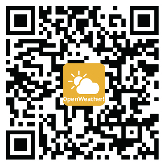

# OpenWeather


```
我們團隊是一群大學學生，收集了世界各地天氣資訊，並且使用OpenData政府公開資料為依據，以不同的角度去欣賞天氣 ☀☁☂
目前團隊釋出第一版讓各位體驗，未來陸續會新增各功能盡請期待 !
為了使App能更好，我們團隊希望您能撥空給我們一些意見回饋，
希望花點時間幫我們做問卷謝謝= )
您寶貴的意見是我們創造的原動力:https://goo.gl/GK57v7

-以視覺圖像的方式讓您了解現在的天氣概況
-使用GPS偵測目前位置，顯示目前所在地的即時天氣
-目前狀況掌握今日高低溫以及目前體感溫度
-風速風向搭配動畫一目了然
-詳細的氣壓、濕度、能見度資訊
-天文方面顯示日出日落時間，搭配仰角顯示目前太陽所在位置
-提供詳細的氣象資訊，包括五日十日天氣預報
-Android6.0初次執行時會要求GPS的存取權限，允許才能正常執行哦~
-初次執行App會建立資料庫，請確認GPS是否有開啟，若首次執行閃退是正常現象(待解決)，再次開啟App即可正常運作
-App背景圖片正急尋原作者，若看到請與我們聯絡哦 !
-若有合適想投稿的背景圖示(各地風景極佳，勿過於花俏)也歡迎mail與我們聯絡 !

To application, we collected the OpenData provided by the government as a visual presentation. 
The content includes real-time weather, air temperature map, UV, PM2.5, real-time reservoir, 
air quality six functions. The difference with other Apps is that we not only present this 
information, but also collect the weather and the health effects between the human body. 
We put the logic in the App, showing its differences with existing products, and to remind 
users of the activities of the proposed recommendations and protective measurement.
```

# 版本log
```
新功能
2.0.3
☀修正AQI數值的標準
☀修正PM2.5頁面遷移網址
☀修正氣溫圖連線失敗問題
2.0.2
☀紫外線部分修正讀取不到問題
☀AQI & PM2.5修正讀取不到問題
2.0.1
☀新增建議與回饋表單
2.0.0
☀全台氣溫圖結合生活品質建議
☀即時紫外線
☀空氣品質(PM2.5、AQI)
☀全台PM2.5俯視圖(感謝藍爸在技術上提供)
☀全台即時水庫
```
公開資料來源:行政院環境保護署、中央氣象局、Yahoo Weather API

Google Play商店下載=>https://play.google.com/store/apps/details?id=com.openweather.openweather



最後更新時間:2017/10/9
